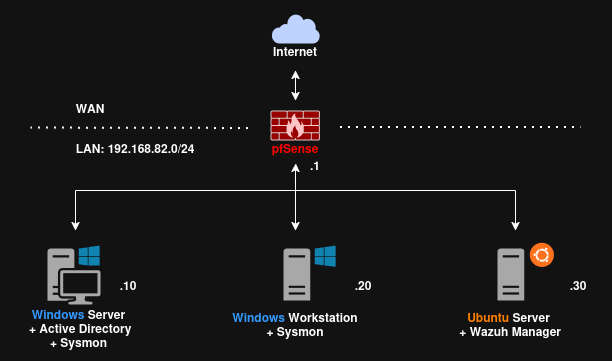

# soc-home-lab
As an aspiring engineer aiming to work in a SOC, I have started building my own `SOC laboratory` at home. Having this kind of environment will be extremely valuable, as it allows me to practice and improve my ability to analyze computer events more effectively.

I got inspired by [**LetsDefend**](https://letsdefend.io/)'s **SOC Analyst Learning Path** and then made my own modifications to customize it.

## Used technologies
- [`Oracle VirtualBox`](https://www.virtualbox.org/wiki/Downloads): a virtualization platform used to create, manage, and host **virtual machines**, providing isolated environments for testing, analysis, and experimentation.

- [`pfSense`](https://atxfiles.netgate.com/mirror/downloads/): a FreeBSD-based **firewall** and routing platform that controls and monitors network traffic, enabling the creation of a secure WAN-LAN separation. It can export detailed firewall logs for analysis, and serves as the primary gateway for the internal network.

- [`Windows Server 2022`](https://www.microsoft.com/en-us/evalcenter/evaluate-windows-server-2022): a Windows Server for a machine providing **Active Directory Domain Services** (AD DS). It functions as the central identity and access management system, simulating a realistic enterprise environment and generating authentication and directory-related event logs. To enrich the environment, the [`BadBlood`](https://github.com/davidprowe/BadBlood) tool can be used to automatically populate Active Directory with users, groups, organizational units, and computers, creating a large dataset for a SOC training.

- [`Windows 10 Workstation`](https://www.microsoft.com/en-us/software-download/windows10ISO): a standard Windows 10 for a user machine used to safely run malware simulations and generate (noise) realistic endpoint activity, such as authentication attempts, process creation events, file operations, and network traffic. This helps emulate typical benign user/attacker behavior.

- [`Ubuntu Server`](https://ubuntu.com/download/desktop): a standard Ubuntu for a machine running the **Wazuh** Manager (Server), functioning as the core **SIEM** and **XDR** platform for the lab environment. It collects and correlates logs from all nodes in the network, including the Windows Server, Windows workstation, and pfSense firewall, while generating alerts, dashboards, and custom detection rules.

- [`Sysmon`](https://learn.microsoft.com/en-us/sysinternals/downloads/sysmon) [[sysmonconfig](https://github.com/olafhartong/sysmon-modular/blob/master/sysmonconfig.xml)]: a Microsoft tool that logs process creation, network connections, file changes, registry activity. Detects persistence techniques, beaconing, credential dumping, etc.

## Network architecture


The network is splitted in two parts:
| Network name | Purpose             | pfSense NIC                   | Other VMs                                          |
| ------------ | ------------------- | ----------------------------- | -------------------------------------------------- |
| **WAN**      | Internet access     | NIC1 (NAT or bridged adapter) | none                                               |
| **SOCNet**   | Lab (corporate) LAN | NIC2                          | Windows Server, Windows Workstation, Ubuntu Server |

And these are the IP addresses:
```
pfSense WAN: NAT/Internet IP assigned by VirtualBox

Internal LAN:        192.168.82.0/24
pfSense LAN:         192.168.82.1 (LAN gateway)
Windows Server:      192.168.82.10
Windows Workstation: 192.168.82.20
Ubuntu/Wazuh:        192.168.82.30
```

## VMs resources and settings
Given the restricted resources of my host machine, I limited the resources allocated to the various virtual nodes.

#### pfSense node
```
CPU:   1 core
RAM:   1 GB
Disk: 15 GB
NICs:
- NIC1 -> NAT (WAN) for Internet
- NIC2 -> Internal Network "SOCNet"
- IP address -> 192.168.82.1/24
- Gateway    -> N/A
- DNS        -> N/A
```

#### Windows Server node
```
CPU:   1 core
RAM:   1 GB
Disk: 50 GB
NICs:
- NIC1 -> Internal Network "SOCNet"
- IP address -> 192.168.82.10/24
- Gateway    -> 192.168.82.1
- DNS        -> 192.168.82.10 (itself)
```

#### Windows Workstation node
```
CPU:   1 core
RAM:   1 GB
Disk: 50 GB
NIC:
- NIC1 -> Internal Network "SOCNet"
- IP address -> 192.168.82.20/24
- Gateway    -> 192.168.82.1
- DNS        -> 192.168.82.10
```

#### Ubuntu Server (Wazuh Manager) node
```
CPU:   2 cores
RAM:   4 GB
Disk: 50 GB
NIC:
- NIC1 -> Internal Network "SOCNet"
- IP address -> 192.168.82.30/24
- Gateway    -> 192.168.82.1
- DNS        -> 192.168.82.10
```
<!-- it needs more RAM because of Elasticsearch -->

#### Sysmon deployment
- Installed on the Windows Server and Windows Workstation to have full coverage of domain events (DC) and endpoint(s) (workstation(s)) events.
- Configured to send logs to the Wazuh Manager via Wazuh Agents installed on each Windows machine.
